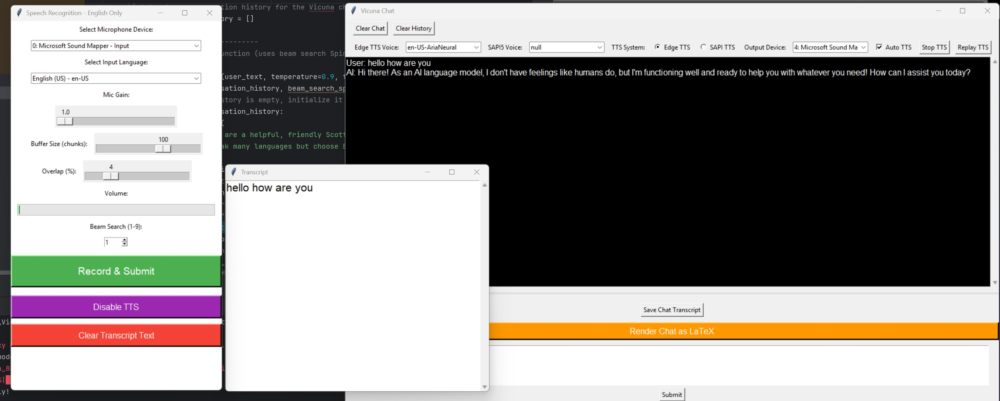

# Vicuna Chat Program using Tkinter interface

This program is a combined speech recognition and Vicuna-based chatbot application. It uses various libraries for audio processing, text-to-speech, and language modeling.
It uses Google for speech recognition so is relatively fast for that. Uses Microsoft edge voices and also SAPI 5. (you can choose)
I'm using a 16G Nvidia 5070 graphics card. You will need something of that order. Even then this is run in 4 bit mode.This means the model paramaters are represented as 4 bits not the whole program.

I use. Cude 12.8 and install Torch as follows at this time:
pip install --pre torch torchvision torchaudio --extra-index-url https://download.pytorch.org/whl/nightly/cu128

Everything else is relatively straight forward. I had a bit of difficulty downloading Vicuna
from Hugging Face. You will need a free account probably. Sometimes it will download into cache
but other times you can pre-download it and I store it in c:\models for example or a desired dirctory.
Its using 4 bit version of Vicuna 13b and sometimes surprises you but not often.
It is good at Languages of course and bad at Maths! It is based on LLAMA. It's a good place to learn about LL models.
I use Pycharm for everything in Python but you don't have to and can be done at the command prompt.
Tom Moir 3/2/2025  Correspondence tomspeechnz@gmail.com
Thanks to all the really smart people who made this model, it wasn't me! See this webpage 

https://lmsys.org/blog/2023-03-30-vicuna/

 
reference: Vicuna is a joint effort with collaborators from multiple institutions, including UC Berkeley, CMU, Stanford, UC San Diego, and MBZUAI.
## Requirements

Ensure you have **Python 3.8+** installed. Install the necessary Python packages with:

~~~bash
pip install -r requirements.txt
~~~

> **Note:** The `requirements.txt` file includes all required packages except for PyTorch, which is managed separately (for example, for CUDA support).

## Model Setup

The Vicuna model can be loaded in one of two ways:

### Option 1: Automatic Download via Hugging Face Hub

If the Vicuna model is hosted on the Hugging Face Hub and you have access to it, you can have it downloaded automatically and cached locally. Modify your code as follows:

~~~python
print("Loading Vicuna Tokenizer...")
vicuna_tokenizer = AutoTokenizer.from_pretrained("your-username/vicuna-13b-v1.3", use_fast=False)
print("Loading Vicuna Model in 4-bit mode...")
vicuna_model = AutoModelForCausalLM.from_pretrained(
    "your-username/vicuna-13b-v1.3",
    torch_dtype=torch.float16,
    load_in_4bit=True,
    bnb_4bit_compute_dtype=torch.float16,
    bnb_4bit_quant_type="nf4",
    llm_int8_enable_fp32_cpu_offload=False,
    device_map="auto"
)
print("Vicuna Model Loaded Successfully!")
~~~

With this setup, the Transformers library will automatically download the model on the first run and cache it (usually in `~/.cache/huggingface/transformers`).

### Option 2: Manual Model Download

If the model is not hosted publicly or you prefer to manage it manually, download the model files yourself and place them in a directory on your system. Then update your code with the correct local path. For example:

~~~python
# Define the path to the Vicuna model (ensure you have downloaded and placed it here)
vicuna_model_path = r"C:\models\vicuna-13b-v1.3"
print("Loading Vicuna Tokenizer...")
vicuna_tokenizer = AutoTokenizer.from_pretrained(vicuna_model_path, use_fast=False)
print("Loading Vicuna Model in 4-bit mode...")
vicuna_model = AutoModelForCausalLM.from_pretrained(
    vicuna_model_path,
    torch_dtype=torch.float16,
    load_in_4bit=True,
    bnb_4bit_compute_dtype=torch.float16,
    bnb_4bit_quant_type="nf4",
    llm_int8_enable_fp32_cpu_offload=False,
    device_map="auto"
)
print("Vicuna Model Loaded Successfully!")
~~~

Make sure to adjust the path (for example, `C:\models\vicuna-13b-v1.3`) to the location where you have placed the model files.

## Running the Program

After installing all dependencies and setting up the model, follow these steps:

1. **Activate your virtual environment (if using one):**

   ~~~bash
   source .venv/bin/activate    # on Unix/macOS
   .venv\Scripts\activate     # on Windows
   ~~~

2. **Run the main program:**

   ~~~bash
   python main.py
   ~~~

## Additional Notes

- **Speech Recognition:**  
  This program uses the [SpeechRecognition](https://pypi.org/project/SpeechRecognition/) package, imported as:

  ~~~python
  import speech_recognition as sr
  ~~~

- **Text-to-Speech:**  
  The application supports both Edge TTS (via [edge-tts](https://pypi.org/project/edge-tts/)) and SAPI TTS (via [pyttsx3](https://pypi.org/project/pyttsx3/)). You can toggle between them using the GUI options.

- **CUDA and PyTorch:**  
  PyTorch is installed separately to support CUDA. Ensure you install the correct version for your system if you plan to use GPU acceleration.

- **Accelerate Library:**  
  If you encounter errors related to low CPU memory usage or device mapping, make sure the [Accelerate](https://huggingface.co/docs/accelerate/) library is installed:

  ~~~bash
  pip install "accelerate>=0.26.0"
  ~~~

When running 3 Tkinter windows should open. First one is speech recognition, second is the text input window
from the speech recognition (that's where it goes), and the third is Vicuna + Text to Speech.
You can use the third window on its own in text mode only if you like.

Enjoy using the Vicuna Chat Program!
